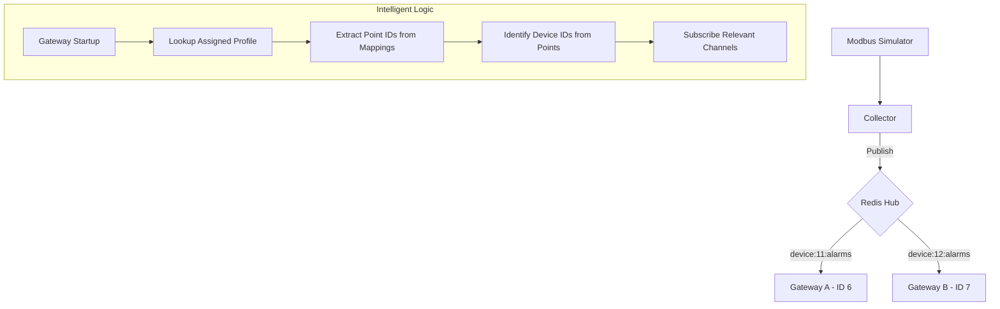

# Selective Subscription(선택적 구독) 구현 계획서

본 문서는 Redis Pub/Sub의 성능을 최적화하고 멀티 프로세스 환경에서 게이트웨이의 효율성을 극대화하기 위한 "지능형 선택적 구독" 아키텍처 구현 계획을 담고 있습니다.

## 1. 개요 및 목적

현재 Export Gateway는 `alarms:all` 채널을 구독하여 시스템의 모든 알람을 수신한 뒤, 자신과 상관없는 데이터를 소프트웨어 레벨에서 필터링합니다. 이는 대규모 시스템에서 불필요한 네트워크 트래픽과 CPU 소모를 야기합니다.

**목적**: 게이트웨이가 자신에게 할당된 디바이스의 데이터만 Redis로부터 직접 수신하도록 개선하여 시스템 성능을 최적화합니다.

## 2. 핵심 아키텍처 (Selective Subscription)

컬렉터가 이미 디바이스별로 데이터를 게시하고 있으므로, 게이트웨이가 "자신이 처리해야 할 디바이스"가 무엇인지 스스로 판단하여 해당 채널만 구독합니다.

### 데이터 흐름도

## 3. 세부 구현 단계

### 1단계: DynamicTargetManager 기능 확장
- **역할**: DB에서 타겟을 로드할 때, 해당 타겟들(프로파일)과 연결된 데이터 포인트들이 속한 **디바이스 ID 목록**을 추출하는 로직을 추가합니다.
- **구현 내용**: `loadFromDatabase()` 수행 시 `export_target_mappings`와 `data_points` 테이블을 조인하여 연관된 `device_id` 집합(Set)을 생성합니다.

### 2단계: ExportCoordinator 연동
- **역할**: 매니저로부터 추출된 디바이스 ID 목록을 받아 `EventSubscriber`에게 전달합니다.
- **구현 내용**: `start()` 및 `reloadTargets()` 시점에 구독 채널을 업데이트하는 브릿지 함수를 구현합니다.

### 3단계: EventSubscriber 동적 구독 개선
- **역할**: 실행 중에도 구독 채널을 안전하게 변경(Add/Remove)할 수 있도록 보강합니다.
- **구현 내용**:
    - 기존 `alarms:all` 기본 구독을 비활성화 옵션으로 변경.
    - 전달받은 디바이스 ID 목록을 바탕으로 `device:{id}:alarms` 패턴의 채널들을 구독 목록에 반영.

## 4. 검증 계획 (Verification)

### 시나리오: 다중 디바이스 격리 테스트
1. **환경 구성**:
    - 디바이스 2대 등록 (ID 11, ID 12).
    - 게이트웨이 A는 디바이스 11의 포인트만 매핑.
    - 게이트웨이 B는 디바이스 12의 포인트만 매핑.
2. **테스트 수행**:
    - 디바이스 12에서 알람 발생.
3. **기대 결과**:
    - Redis `MONITOR` 상에서 알람은 게시되지만, **게이트웨이 A의 로그에는 어떤 수신 기록도 남지 않아야 함** (네트워크 레벨 필터링 성공).
    - 게이트웨이 B는 정상적으로 데이터를 수신 및 전송.

## 5. 기대 효과
- **네트워크 부하 감소**: 불필요한 메시지 전송이 차단되어 Redis 대역폭 효율성 증대.
- **CPU 리소스 절약**: 게이트웨이 프로세스에서 상관없는 JSON 데이터를 파싱하고 버리는 오버헤드 제거.
- **확장성(Scalability)**: 디바이스와 게이트웨이 인스턴스가 늘어나도 시스템 전체 부하가 선형적으로 증가하지 않음.
